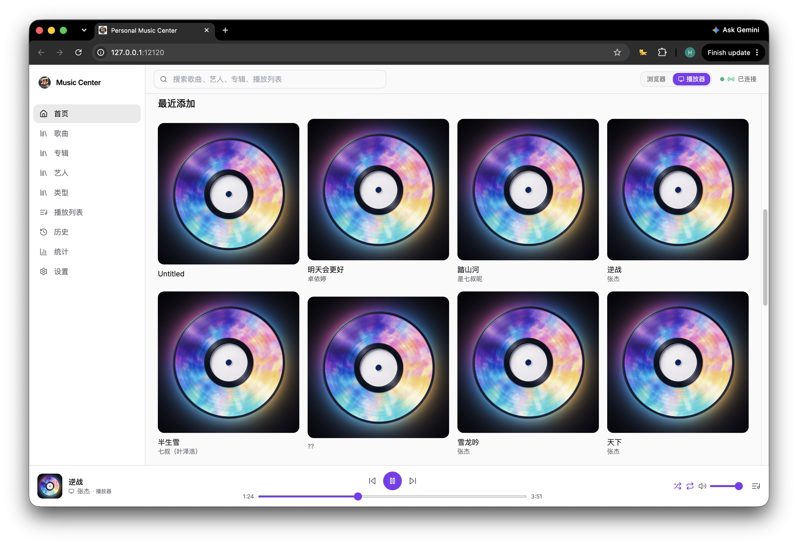
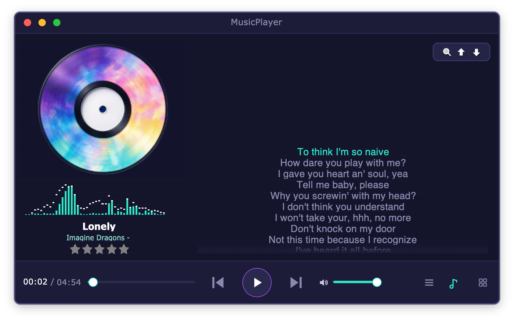
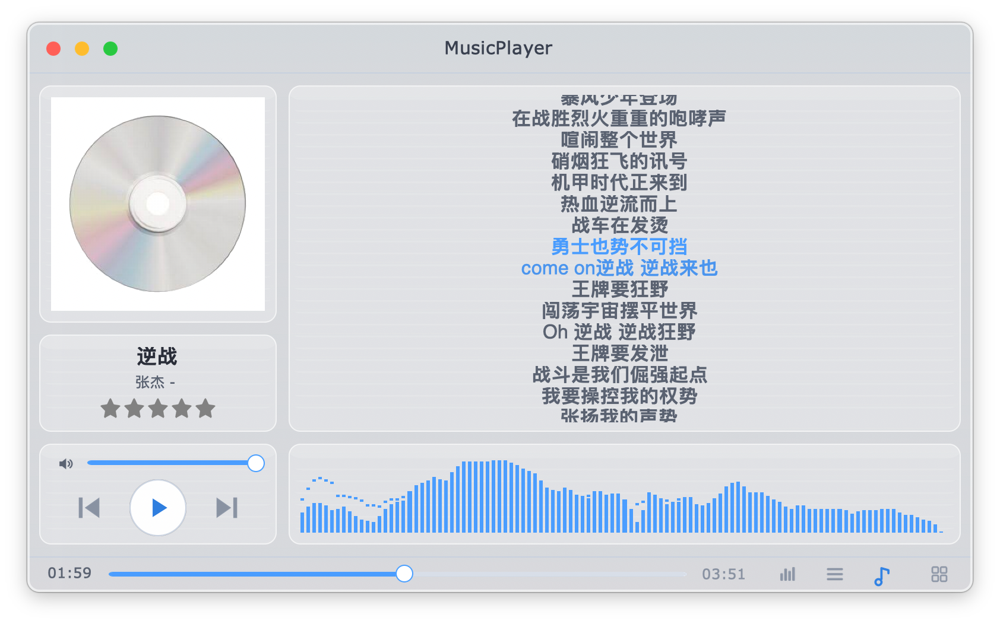

# MusicPlayer — 停下来，只为听歌

播放器越做越大、越做越慢。我们把它倒过来：**小巧、轻快、无广告**，把音乐还给你。

MusicPlayer 是一款开源、免费、无广告的桌面音乐播放器，自绘界面，跨平台运行在 **Windows** 与 **macOS** 上。它回到播放器本来的样子——打开就播，好看、好用，不打扰。

## 功能介绍

* **歌曲播放**，支持多种格式（MP3、AAC/M4A、OGG、FLAC、WAV 等）
* **滚动歌词显示**，与当前播放曲目同步
* **小巧、资源占用少**——对内存、CPU 和磁盘都很轻量
* **网页版媒体中心**——在浏览器里管理你的歌库：专辑、歌手、搜索、统计等
* **很酷的皮肤**——可切换、可自定义，内置 Neon / Glass 皮肤
* **开源、免费、无广告**
* **跨平台**：Windows、macOS

## 跨平台

* **Windows** — 原生的 Win32 界面
* **macOS** — 原生的 Cocoa / AppKit 界面

## 它适合谁？

* 讨厌臃肿、只想干净听歌的你
* 有大量本地音乐、需要好好管理的你
* 喜欢动手、想换一套与众不同皮囊的你
* 看重开源与无广告体验的你

## 了解更多

- 项目源码与使用文档见仓库 [README](../README.zh-cn.md)
- 皮肤制作：[`docs/skin-authoring.md`](../skin-authoring.md)
- 网页媒体中心设计：[`docs/web-console/README.md`](../web-console/README.md)

MusicPlayer，停下来，只为听歌。